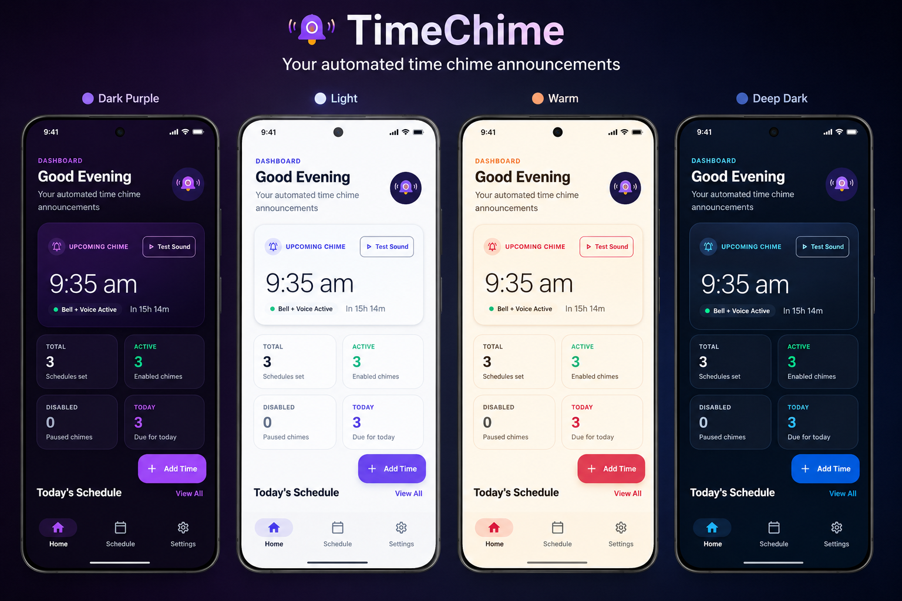
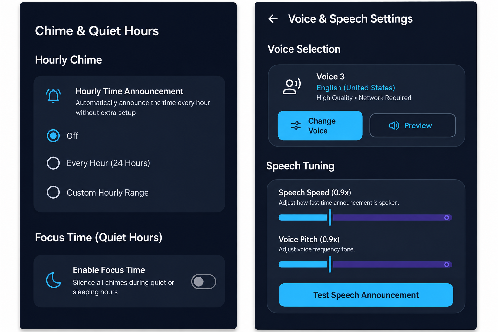

<!-- ========================= HEADER ========================= -->

<div align="center">


<br>


</div>

---

# ⏰ TimeChime

### Every Moment Matters.

TimeChime is a lightweight Android productivity companion that helps you stay aware of time throughout the day through customizable chimes and spoken time announcements.

Whether you're working, studying, taking breaks, or maintaining a daily routine, TimeChime provides simple and calming time announcements without behaving like a traditional alarm.

---

<!-- ========================= FEATURES ========================= -->

## ✨ Features

<div align="center">

| ⏰ Time | 🔊 Audio | 🎯 Focus |
|:---:|:---:|:---:|
| Custom time announcements | Built-in chime collection | Focus Time / Quiet Hours |
| Hourly chime | Custom notification sounds | Custom hourly ranges |
| Precise scheduled announcements | Multiple system voice options | Custom repeat days |

</div>

### More Features

- ⏰ Custom time announcements
- 🕐 Hourly chime
- 🗣️ Spoken time announcements
- 🎙️ Multiple system voice options
- 🔊 Built-in chime collection
- 🎵 Custom notification sounds
- 📅 Custom repeat days
- 🌙 Focus Time / Quiet Hours
- ⏱️ Custom hourly time ranges
- 🎨 Multiple themes
- 📱 Responsive interface
- 🔔 Customizable announcement sounds
- ⚡ Precise scheduled announcements
- 🌙 Clean and simple interface

---

## 🎯 Use Cases

TimeChime can be useful for:

- 💼 Productivity
- 📚 Studying
- 🖥️ Work routines
- ☕ Break reminders
- ⏰ Time awareness
- 📅 Daily routines
- 🎯 Focus sessions
- ❤️ Healthy routines

---

<!-- ========================= HOW IT WORKS ========================= -->

## 🕐 How It Works

Create an announcement for the time you want.

For example:

<div align="center">

### `02:00 PM`

⬇️

🔔 **Chime**

⬇️

🗣️ **"It is 2 PM."**

</div>

You can also configure TimeChime to announce the time every hour within a specific period.

For example:

```text
02:00 PM ──────────────── 10:00 PM
   🔔        🔔        🔔        🔔
```

---

## 📱 App Screenshots

<div align="center">

> **A closer look at TimeChime's clean and simple experience.**

### 🏠 Home Dashboard



### 🎙️ Voice & Speech Settings + 🔔 Chime & Quiet Hours



</div>

---

## 🚀 Coming Soon on Google Play

<div align="center">

### 📱 TimeChime is getting ready for launch!

We're working toward bringing **TimeChime to the Google Play Store** so you can easily install it and keep every moment within reach.

**Google Play release coming soon.** 🔔

<br>

🛠️ **Currently:** Finalizing the release  
📱 **Platform:** Android  
🚀 **Next:** Google Play Store

</div>

---

## 💙 Conclusion

TimeChime is built to make time awareness simple, calm, and useful — helping you stay on track without turning every moment into an alarm.

### 🚀 Coming Soon

**TimeChime will soon be live on the Google Play Store.**

Stay tuned for the launch and get ready to make every moment count. ⏰💙

> **Stay aware. Stay focused. Make every moment count.**
